# How to Duplicate Kintone Apps? <!-- omit in toc -->

This article will explore the different ways to duplicate Kintone Apps (copying an App) with and without the data stored inside.

## Table of Contents <!-- omit in toc -->

* [Prerequisite](#prerequisite)
* [Method 1: Creating a New App by Duplicating an Existing App](#method-1-creating-a-new-app-by-duplicating-an-existing-app)
  * [Steps to Duplicate an Existing App](#steps-to-duplicate-an-existing-app)
* [Method 2: App Template](#method-2-app-template)
  * [What Is an App Template?](#what-is-an-app-template)
  * [Multiple Apps in one App Template?](#multiple-apps-in-one-app-template)
  * [Steps to Create an App Template](#steps-to-create-an-app-template)
  * [Creating an App from an App Template](#creating-an-app-from-an-app-template)
  * [Which Settings Cannot Be Included in an App Template?](#which-settings-cannot-be-included-in-an-app-template)
* [Migrating Records from the Original App to the New App](#migrating-records-from-the-original-app-to-the-new-app)
  * [Exporting App Data (Records) as a CSV file](#exporting-app-data-records-as-a-csv-file)
  * [Importing App Data (Records) from a CSV file](#importing-app-data-records-from-a-csv-file)
  * [How to bulk download all the Attachments from a Kintone App?](#how-to-bulk-download-all-the-attachments-from-a-kintone-app)
* [Guest Space](#guest-space)

---

## Prerequisite

Management permission is required to duplicate the App.

For details, refer to [Setting App Permissions](https://get.kintone.help/k/en/user/App_settings/rights/App_rights.html) help doc.

---

## Method 1: Creating a New App by Duplicating an Existing App

This is the easiest way to get the job as it only uses Kintone's standard functions (no customization).  
Only the App's Fields settings and Process Management settings will be copied over.

The following are not copied to the new App:
* [App Code](https://get.kintone.help/k/en/user/App_settings/App_othersettings/Appcode.html)
* [API Token](https://get.kintone.help/k/en/glossary/api_token.html)
* [Plug-ins](https://developer.kintone.io/hc/en-us/articles/212495268) and corresponding App settings
* [App's Records](https://get.kintone.help/k/en/glossary/records.html) (i.e., App's data)

### Steps to Duplicate an Existing App

(1) Click on the ➕ Button to the right of Apps Create App.
* Direct URL: `https://_YourSubdomain_.kintone.com/k/#/market`
* 

(2) From the Kintone Marketplace screen, click on the `Create from Existing App` option.
* 
* If the `Create from Existing App` option does not appear, the user does not have management permissions for any App or has not been created on Kintone.

(3) From the Create from an Existing App screen, click on the `Duplicate This App` Button next to the desired App to duplicate.
* 

(4) The App is duplicated & the settings screen of the new App will open
* 

(5) Click on the `Activate App` Button to complete the process.
* The new App will contain no Records.
* Only the App's fields and Process Management settings will be duplicated.
* 

For more information, refer to [Creating a New App by Duplicating an Existing App (Copying an App)](https://get.kintone.help/k/en/user/create_App/App_recycle.html) help doc.

---

## Method 2: App Template

### What Is an App Template?

* An App Template is a model that users can use to create Apps with the defined settings preemptively applied to the new App.
* App templates can be created from existing Apps.
* Creating or deleting App templates requires Kintone Administrative permission.
* For more information, refer to [What Is an App Template?](https://get.kintone.help/k/en/admin/app_admin/template/whats_template.html) help doc.

⚠️ Caution
* Templates can be created only from activated Apps.
* The App Template will not include some settings. For more information, refer to the [Settings That Are Not Included in App Templates](https://get.kintone.help/k/en/admin/app_admin/template/template_settings.html) help doc.

### Multiple Apps in one App Template?

Multiple Apps can be included in one App Template.  
Also, when an App references other Apps (e.g., Lookup field), the referenced Apps are automatically included in the App Template.

Following Settings are able to be included in the App Template:
* [Lookup fields](https://get.kintone.help/k/en/user/app_settings/form/form_parts/field_lookup.html)
* [Related Records fields](https://get.kintone.help/k/en/user/app_settings/form/form_parts/field_related_records.html)
* [App actions](https://get.kintone.help/k/en/user/app_settings/appaction.html)

### Steps to Create an App Template

(1) From the Kintone Portal Top screen, click on the Kintone Menu Bar's Gear Icon ⚙ > `Kintone Administration`.
* 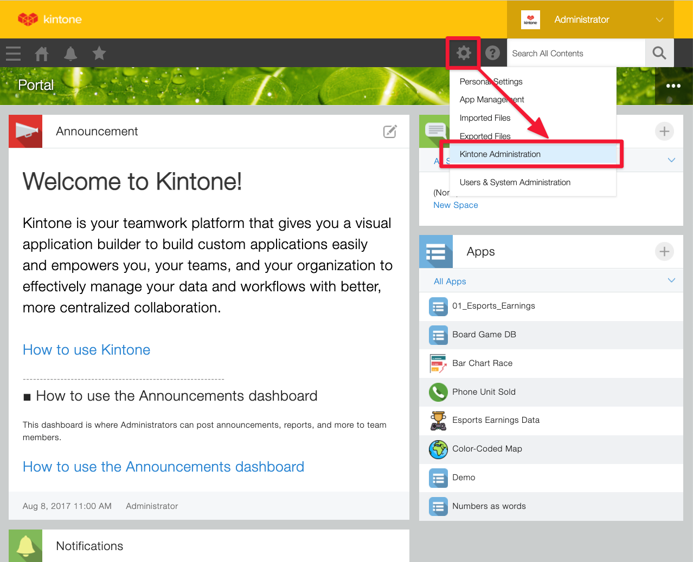

(2) From the Kintone Administration screen, click on the `App Templates` link.
* `Apps` > `App Templates`
* App Template Setting's URL: `https://_YourSubdomain_.kintone.com/k/admin/system/template/`

(3) Click the `New` Button from the top-left corner
* 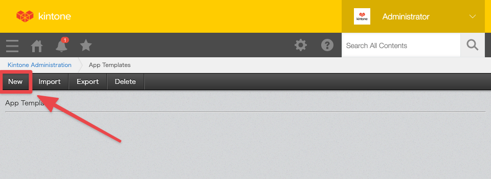

(4) Select the Apps to be included in the App Template.
* If an App includes a field referencing another App, both Apps will be included.
* Multiple Apps can be included together in one App Template pack.
* Click `Next` once the Apps are selected.

(5) Fill in the details for the App Template, including Name, Icon, and Description.
* The included Apps' description can be configured as well.
* Click `Save` once completed.

Completion: The App Template that generates the selected App(s) is created!

An App Template can be exported as a ZIP file to transfer the App outside a Kintone Subdomain.

For more information, refer to [Creating a Template from an App](https://get.kintone.help/k/en/admin/App_admin/template/add_template.html) help doc.

### Creating an App from an App Template

(1) Click on the ➕ Plus Button right of Apps.
* 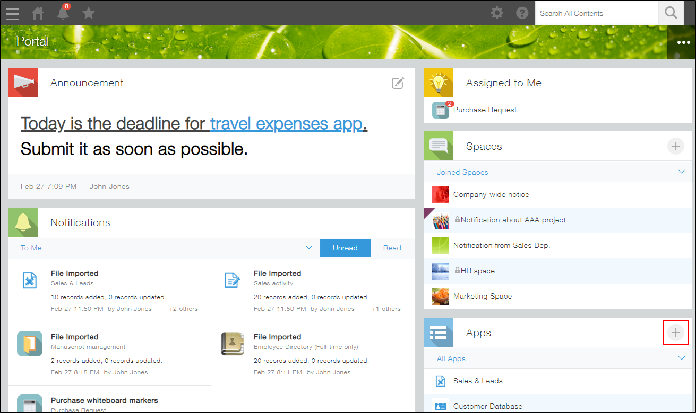

(2) Click the `Create from Template` option under the `Create New App` section.
* 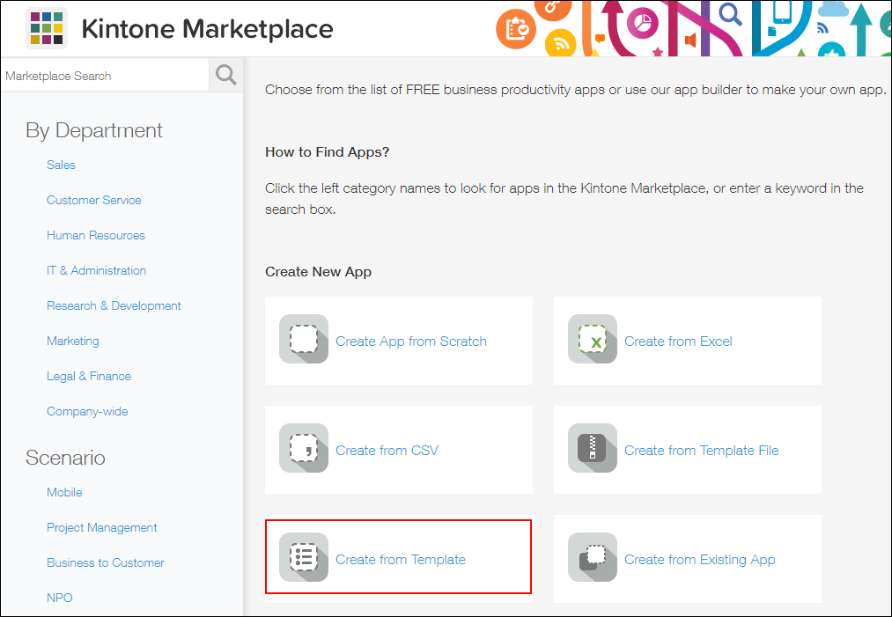

(3) Click `Use This Template` for the desired App Template.
* **Pack** label is placed on App Templates that creates multiple Apps.
* 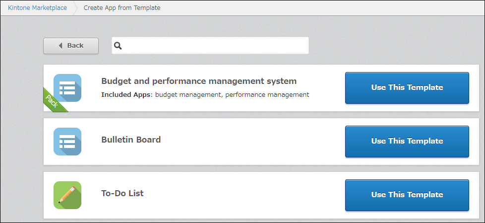

Completion: The App(s) are created from the selected App Template!

For more information, refer to [Creating an App from a Template](https://get.kintone.help/k/en/user/create_app/app_template.html) help doc.

### Which Settings Cannot Be Included in an App Template?

Following settings are not included in App Template:
* App Code
* Access permissions
* Periodic Reports
* Options of the Department Selection field
* API Token
* Settings applied to plug-ins
* Available To setting of an Action  

Following settings are not included in App Template unless configured as specified:

Notification settings
* Unless the notifications are set to the following recipients:
  * Administrator user
  * Administrators group
  * Everyone group
  * "Created by" field
  * "Updated by" field
  * Assignee (when the process management function is enabled)

Options of the User Selection field
* Unless configured to Administrator user, Everyone group, and/or Administrators group

Default value of the User Selection field
* Unless configured to Administrator user, Everyone group, and/or Administrators group

Default value of the Department Selection field
* Unless configured to Priority Department

Options of the Group Selection field
* Unless configured to Everyone group and/or Administrators group

Default value of the Group Selection field
* Unless configured to Everyone group and/or Administrators group

Conditions set in the **Initial filter setting** of the **Lookup** field
* Unless configured to Administrator user and/or login user

Filter conditions of views or reports that use the User Selection, Created by, or Updated by field
* Unless the condition uses the User Selection field and an Administrator user and/or login user is set

Process management
* Unless the Branch Criteria uses a User Selection field that is set to the Administrator user

Assignee
* Unless the assignee is set to the following:
  * Administrator user
  * Administrators group
  * "Created by" field
  * "Updated by" field

---

## Migrating Records from the Original App to the New App

The is no one function to copy a Kintone App that includes the original Records. Ultimately, the App must be duplicated, and the Records from the Original App be exported as a CSV file and imported into the New App.

  ⚠️ Caution  
* The App's **Export to file** and **Import from file** permissions are required.
  * By default, the **Import from file** permission is granted only to App Creators.
  * It is set using the [Permissions for App](https://get.kintone.help/k/en/user/app_settings/rights/app_rights.html) in the App settings page.
* Some fields cannot be exported or imported.
  * For the full list, refer to the [Data Types That Can Be Imported or Exported](https://get.kintone.help/k/en/admin/other/import_export.html) help doc.

### Exporting App Data (Records) as a CSV file

(1) Configure the View to list the desired records to be exported.

(2) Click the Options Button `...` on the upper right of the screen, and then click **Export to File**.
* If the **Export to File** Button is not shown, the user does not have permission to export data to a file.
* 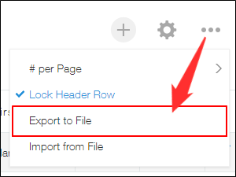

(3) Leave the **Include header row** option enabled.

(4) Select a character encoding and a delimiter to use, if necessary.
* 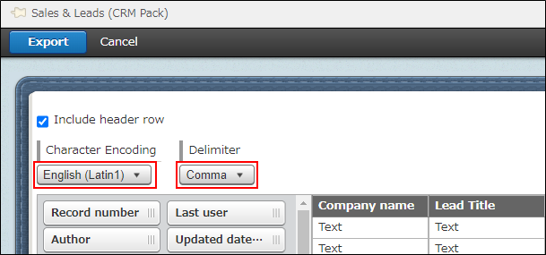

(5) Drag and drop items to be exported.
* Click on **Add All** Button to include all fields in the data export.
* 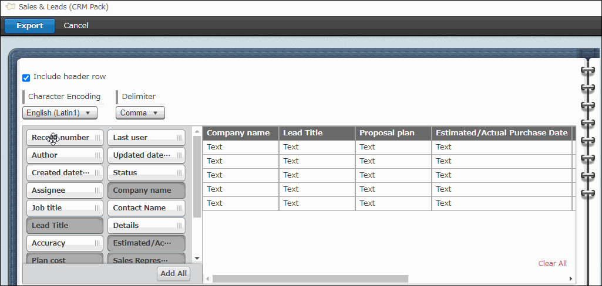
* 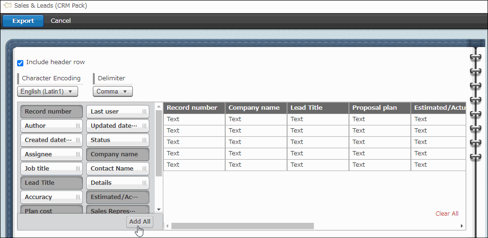

(6) Click **Export** on the upper left of the screen.
* When a data exporting process begins, you are moved to the **Exported Files** screen.
* It may take a few seconds to a few minutes to export a file.
* 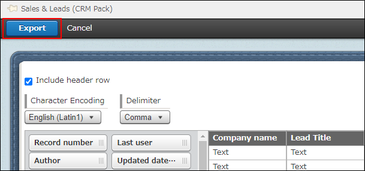

(7) Click **Refresh** on the upper left side of the **Exported Files** screen.
* 

(8) Click the name of the CSV file you want to download.
* 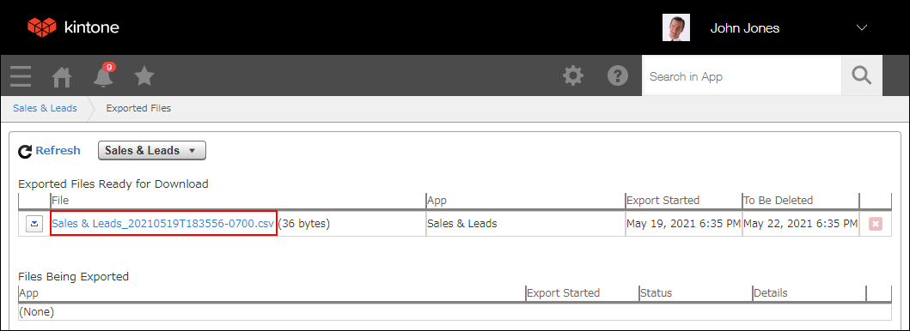

Completion: The CSV file has all the App's data (Records)!

For more information, refer to [Exporting Data to a File](https://get.kintone.help/k/en/user/app_collectdata/export/data_export.html) help doc.

### Importing App Data (Records) from a CSV file

(1) Click the Options Button `...` on the upper right of the screen, and then click the **Import from File** button.
* 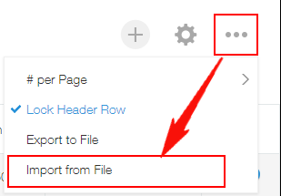

(2) Click **Browse** and specify an Excel file or CSV file to import.

(3) When prompted with **Select Data Scope**, select the **First row is header** option.
* 

(4) For each field in the App, associate it with the column in the file to import.
* Make sure to specify **Column in File** for each of the following fields:
  * Fields where values are to be added
  * Fields where entry is required (marked with an asterisk `*`)
* If a field is not associated with any column under the **Column in File**, it is created as an empty field or with a default value.
* 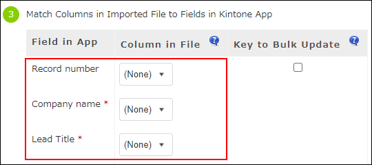

(5) Click **Import** on the upper left side of the screen.
* 

Completion: The App now has the imported data!

For more information, refer to the [Create/Update Records in Bulk: Importing a File](https://get.kintone.help/k/en/user/using_app/import_records/import_csv.html) help doc.

### How to bulk download all the Attachments from a Kintone App?

There is no standard function to bulk download all the Attachments (files uploaded to a Kintone Record via Attachment field) at once.  

Here is an overview of building a JavaScript customization to bulk download attachments.

Required files:
* [JSZipUtils(v0.0.2)](https://github.com/Stuk/jszip-utils) --- used when downloading the files.
* [js(v1.0.0)](https://github.com/eligrey/FileSaver.js) --- used when saving the files.
* [ZipAllFiles.js](ZipAllFiles.js) --- JS Customization by Kintone Developer Program
  * Change the `fieldCode` value to the Attachment field's field code

Upload or state the URL of the files in the **JavaScript and CSS Customization settings** of the App as below, and be sure to list them in the same order.
1. FileSaver.min.js
2. jszip-utils.mini.js
3. <https://js.kintone.com/jszip/v3.1.4/jszip.min.js>
4. ZipAllFiles.js

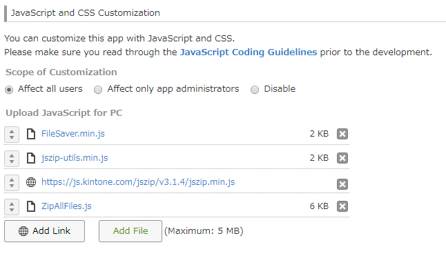

A button should appear on the Record List.

Click the Button to start running the process to download Attachment files as a Zip file.

For more information, refer to the [Bulk download attachments using JSZip](https://developer.kintone.io/hc/en-us/articles/115004137213) tutorial.

---

## Guest Space

* In a Guest Space, only Apps within the same Guest Space can be duplicated with [Method 1](#method-1-creating-a-new-app-by-duplicating-an-existing-app).
* To duplicate Apps not inside a Guest Space, refer to [Method 2](#method-2-app-template).
