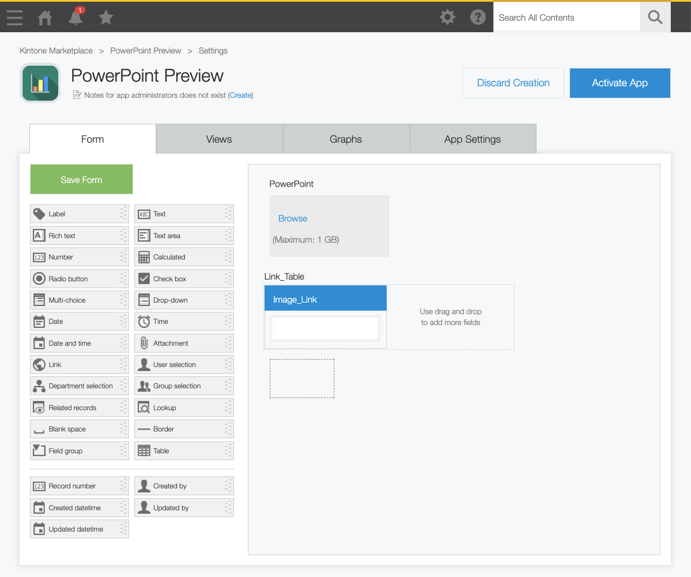
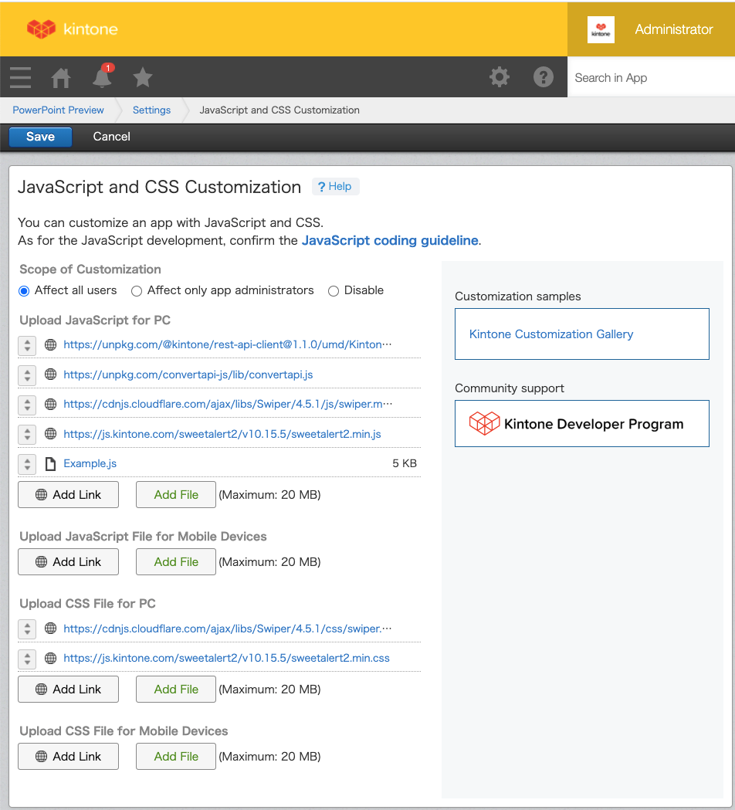

# Preview PowerPoint Slides on Kintone

Here is an example of Kintone Customization that enables PowerPoint slides to be previewed on the Kintone Record Details page as images.

## Demo
Preview the PowerPoint slides on the Record Details page. The PowerPoint file is saved to the Record with Attachment field. Preview images are generated automatically when the record is saved. This takes about half a minute.


## ConvertAPI Setup
Convert API is used to convert PowerPoint slides to images.
You can use the API for free for up to 1500 seconds of conversion time.
A file can take from a few seconds to tens of seconds, depending on the slide count.

1. Create an account: [Sign Up - ConvertAPI](https://www.convertapi.com/a/signup).
2. Memo the value of "Secret" on the [Authentication](https://www.convertapi.com/a/auth) page.
3. Replace the `*****` value for secrete on **SlidePreview.js** line 4 with your ConvertAPI Secrete value.

## SlidePreview.js

```javascript
(function () {
  'use strict';

  var secret = '*****'; // Private key for Convert API authentication
  var previewWidth = '500px'; // Preview display size
  var slideField = 'PowerPoint'; // Attachment field code
  var imageTableField = 'Link_Table'; // Table field code
  var imageField = 'Image_Link'; // Image_Link field code
  var spaceField = 'Space'; // Space Element ID

  kintone.events.on([
    'app.record.create.submit.success',
    'app.record.edit.submit.success',
  ], function (event) {
    var slideValue = event.record[slideField].value[0];
    
    // Verify if a file is uploaded
    if (!slideValue) {
      return event;
    }

    console.log('slideValue');
    console.log(slideValue);

    // SweetAlert2 popup alert
    Swal.fire({
      icon: `success`,
      title: `PowerPoint file is uploaded!\n Now generating the preview...`,
      text: `Don't reload the page`,
      showConfirmButton: false,
      showCancelButton: true,
      cancelButtonText: 'Done',
      didOpen: () => {
        Swal.showLoading()
      },
      allowOutsideClick: () => !Swal.isLoading()
    })

    // Declare the API client for Kintone REST API
    var client = new KintoneRestAPIClient();

    // Download the PowerPoint file
    return client.file.downloadFile({
      fileKey: slideValue.fileKey
    }).then(function (fileData) {

      // Build ConvertAPI's PPTX to PNG POST API call
      var convertApi = ConvertApi.auth({
        secret
      });
      var params = convertApi.createParams();
      params.add('File', new File([fileData], slideValue.name));

      console.log('params');
      console.log(params);

      return convertApi.convert('pptx', 'png', params);
    }).then(function (response) {

      console.log('response');
      console.log(response);

      // Save ConvertAPI download links inside Link_Table > Image_Link
      var body = {
        app: event.appId,
        id: event.recordId,
        record: {
          [imageTableField]: {
            value: response.dto.Files.map(

              function (file) {

                var a = {
                  value: {
                    [imageField]: {
                      value: file.Url
                    }
                  }
                };
                console.log('a');
                console.log(a);
                return a
              })
          }
        }
      };

      console.log('body');
      console.log(body);

      // Update Kintone Record
      return client.record.updateRecord(body);
    });
  });

  // Create the Preview
  kintone.events.on([
    'app.record.detail.show',
  ], function (event) {

    kintone.Promise.all(

      // Get the images from Link_Table > Image_Link
      event.record[imageTableField].value.map(function (row) {
        var xhr = new XMLHttpRequest();
        xhr.open('GET', row.value[imageField].value);
        xhr.responseType = 'blob';
        var promise = new kintone.Promise(function (resolve) {
          xhr.addEventListener('load', function () {
            resolve(URL.createObjectURL(xhr.response));
          });
        });
        xhr.send();
        return promise;
      })
    ).then(function (urls) {

      // Create Picture Slide with Swiper
      var swiperContainer = document.createElement('div');
      var swiperWrapper = document.createElement('div');
      var swiperButtonPrev = document.createElement('div');
      var swiperButtonNext = document.createElement('div');
      swiperContainer.classList.add('swiper-container');
      swiperWrapper.classList.add('swiper-wrapper');
      swiperButtonPrev.classList.add('swiper-button-prev');
      swiperButtonNext.classList.add('swiper-button-next');
      swiperContainer.style.width = previewWidth;
      urls.forEach(function (url) {
        var swiperSlide = document.createElement('div');
        swiperSlide.classList.add('swiper-slide');
        var image = document.createElement('img');
        image.setAttribute('src', url);
        image.style.width = '100%';
        swiperSlide.appendChild(image);
        swiperWrapper.appendChild(swiperSlide);
      });
      swiperContainer.appendChild(swiperWrapper);
      swiperContainer.appendChild(swiperButtonPrev);
      swiperContainer.appendChild(swiperButtonNext);
      kintone.app.record.getSpaceElement(spaceField).appendChild(swiperContainer);
      new Swiper('.swiper-container', {
        navigation: {
          nextEl: '.swiper-button-next',
          prevEl: '.swiper-button-prev',
        }
      });
    });
  });

  // Hide the Link_Table
  kintone.events.on([
    'app.record.detail.show',
    'app.record.create.show',
    'app.record.edit.show',
  ], function (event) {
    kintone.app.record.setFieldShown(imageTableField, false);
  });

})();
```

## Kintone App Setup

### App Fields

| Field name | Field type       | Field code / Element ID |
| ---------- | ---------------- | ----------------------- |
| PowerPoint | Attachment       | `PowerPoint`            |
| Link_Table | Table            | `Link_Table`            |
| Image_Link | Link (Type: URL) | `Image_Link`            |
|            | Space            | `Space`                 |

Place the **Image URL** Link field inside the **Image URL Table** field. A Table field is required since an Image URL Link field is needed per slide to hold the ConvertAPI Image download link.



### JavaScript
Add the following CDN Links under the **Upload JavaScript for PC** section:
1. <https://unpkg.com/@kintone/rest-api-client@1.1.0/umd/KintoneRestAPIClient.min.js>
2. <https://unpkg.com/convertapi-js/lib/convertapi.js>
3. <https://cdnjs.cloudflare.com/ajax/libs/Swiper/4.5.1/js/swiper.min.js>
4. <https://js.kintone.com/sweetalert2/v10.15.5/sweetalert2.min.js>

Then upload the **SlidePreview.js** file.

### CSS
Add the following CDN Links under the **Upload CSS File for PC** section:
1. <https://cdnjs.cloudflare.com/ajax/libs/Swiper/4.5.1/css/swiper.min.css>
2. <https://js.kintone.com/sweetalert2/v10.15.5/sweetalert2.min.css>



## ⚠️ Debugging
* Update **SlidePreview.js** with your ConvertAPI secrete value
* The order of the CDN Links and JS/CSS files does matter. Verify that the **JavaScript and CSS Customization** have all the required links and files in the order as listed above.

## Libraries Used

* [kintone-rest-api-client](https://github.com/kintone/js-sdk/tree/master/packages/rest-api-client)  
  * Kintone REST API Client is an API client for Kintone REST API that supports both browser environment (Kintone customization & plugin) and Node.js environment.  
  * It is used to download the PowerPoint file and update the record with the ConvertAPI image download link.
* [SweetAlert2](https://sweetalert2.github.io/)  
  * SweetAlert2 is a beautiful, responsive, customizable, and accessible (WAI-ARIA) replacement for JavaScript's popup boxes.  
  * Used to create the "Don't reload the page" popup.
* [Swiper](https://swiperjs.com/)  
  * Swiper is a free and modern mobile touch slider intended for mobile websites, mobile web apps, and mobile native/hybrid apps.
  * It is used to create the image slide show.

## Credits
Based on [江田篤史](https://developer.cybozu.io/hc/ja/profiles/5826575706-%E6%B1%9F%E7%94%B0%E7%AF%A4%E5%8F%B2)'s post on cybozu developer network, [パワーポイントファイルをプレビュー](https://cybozudev.zendesk.com/hc/ja/community/posts/900002839683).

## ⚙️ What is Kintone?
[Kintone](https://www.kintone.com/) is a no-code/low-code cloud platform for teams to easily & effectively share and collaborate on their data.

You can add JavaScript, CSS, &/or HTML to enhance the frontend UI/UX of a Kintone App. This can include features such as maps, buttons, and color-coding.

Read up on how to customize and develop on the Kintone platform at [Kintone Developer Program](https://kintone.dev/)
