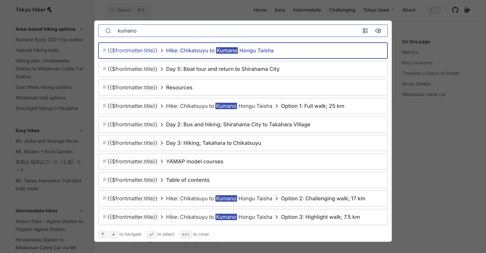
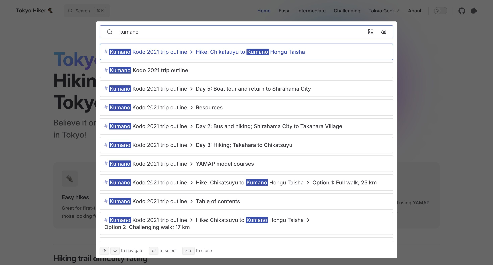

# VitePress debug: "frontmatter.title" is appearing in search results

How to fix the issue of `frontmatter.title` appearing in VitePress search results instead of the actual content.


## Problem

When you first set up VitePress and use frontmatter to define titles and other metadata for your pages, you may notice that the built-in local search shows the literal template expression used in your Markdown instead of the resolved title.

For example, if your page heading uses the `$frontmatter` template global, the local search index can treat the expression as plain text. Your search results may then show something like `{{ $frontmatter.title }}` instead of the actual page title.

Example Markdown file (`docs/markdown-examples.md`):

```md
---
title: My Awesome Page
description: This is an awesome page about VitePress.
---

# {{ $frontmatter.title }}

{{ $frontmatter.description }}
```

For example, when you search for an article on your VitePress site, the result can show:

* 

This happens because the local search plugin renders Markdown to HTML without running Vue. Vue template expressions such as `{{ $frontmatter.title }}` are not evaluated at index time, so they remain as plain text in the search index.


## Solution

If you are using the VitePress local search provider and see `{{ $frontmatter.title }}` (or similar expressions) in your search results, you can customize the local search renderer so that frontmatter-based headings are resolved to plain text before the content is indexed.

VitePress exposes a [`search.options._render` hook](https://vitepress.dev/reference/default-theme-search#custom-content-renderer) for the built-in local search provider. You can use this hook to:

1. Let VitePress render the Markdown once to populate `env.frontmatter` and other metadata.
2. Rewrite the source Markdown to replace `{{ $frontmatter.title }}` in headings with the actual frontmatter title.
3. Render the rewritten Markdown again, and return that HTML for indexing.


### Edit `docs/.vitepress/config.mts`

In your VitePress configuration file (`docs/.vitepress/config.mts`), make sure you are using the local search provider, then add a custom `_render` implementation.

Here is a typical base configuration:

```typescript [docs/.vitepress/config.mts]
import { defineConfig } from 'vitepress'

// https://vitepress.dev/reference/site-config
export default defineConfig({
  title: 'My Awesome Project',
  description: 'A VitePress Site',
  themeConfig: {
    // https://vitepress.dev/reference/default-theme-config
    nav: [
      { text: 'Home', link: '/' },
      { text: 'Examples', link: '/markdown-examples' }
    ],

    sidebar: [
      {
        text: 'Examples',
        items: [
          { text: 'Markdown Examples', link: '/markdown-examples' },
          { text: 'Runtime API Examples', link: '/api-examples' }
        ]
      }
    ],

    socialLinks: [
      { icon: 'github', link: 'https://github.com/vuejs/vitepress' }
    ]
  }
})
```

Update the `themeConfig` object to include the local search configuration with a custom `_render` function:

```typescript [docs/.vitepress/config.mts]
import { defineConfig } from 'vitepress'

export default defineConfig({
  title: 'My Awesome Project',
  description: 'A VitePress Site',
  themeConfig: {
    nav: [
      { text: 'Home', link: '/' },
      { text: 'Examples', link: '/markdown-examples' }
    ],

    // ... other themeConfig options ...

    search: {
      provider: 'local',
      options: {
        async _render(src, env, md) {
          // First pass: render to populate env.frontmatter and other metadata
          await md.renderAsync(src, env)

          // Use empty object as fallback if frontmatter is undefined
          const fm = env.frontmatter ?? {}

          // Honor per-page opt out: `search: false` in frontmatter
          if (fm.search === false) {
            return ''
          }

          let rewritten = src

          // Replace headings like "# {{ $frontmatter.title }}" with a concrete title
          if (typeof fm.title === 'string' && fm.title.trim().length > 0) {
            // Replace H1 that is exactly an interpolation of frontmatter.title
            rewritten = rewritten.replace(
              /^#\s*\{\{\s*\$frontmatter\.title\s*\}\}\s*$/m,
              `# ${fm.title}`
            )

            // Drop any other heading levels that interpolate frontmatter.title
            rewritten = rewritten.replace(
              /^#{2,6}\s*\{\{\s*\$frontmatter\.title\s*\}\}\s*$/gm,
              ''
            )
          }

          // Strip any remaining $frontmatter interpolations from indexable text
          rewritten = rewritten.replace(/\{\{\s*\$frontmatter\.[^}]*\}\}/g, '')

          // Final render used for indexing
          return await md.renderAsync(rewritten, env)
        },
      },
    }, // end of search options
    // ... other themeConfig options ...
  } // end of themeConfig
})
```

Key points:

* `_render` is called only when building the local search index. It does not change how your pages render in the browser.
* You must call `md.renderAsync(src, env)` at least once before reading `env.frontmatter`. VitePress populates `env` during rendering.
* When you provide a custom `_render` function, you are responsible for handling `search: false` in frontmatter, as shown above.

After you save the file, restart your VitePress development server. When you use the local search now, the index will contain the resolved titles instead of the raw `{{ $frontmatter.title }}` expression, and your search UI will show the correct text.


### Result

After implementing the above changes, your search results should display the correct titles and content. For example:

* 

The search index now sees the actual title string (for example, `My Awesome Page`) instead of the Vue template expression, so both relevance and readability improve.


## Conclusion

By customizing the local search renderer in your VitePress configuration file, you can ensure that frontmatter-based headings are resolved before indexing. This makes your search results more accurate, improves readability, and helps visitors find the content they are looking for more easily.

If you prefer not to index a page at all, you can add `search: false` to that page's frontmatter, and have your `_render` hook return an empty string for those pages, as shown in the configuration example above.


## References

* [Search - VitePress docs](https://vitepress.dev/reference/default-theme-search#search)
* [Frontmatter - VitePress docs](https://vitepress.dev/guide/frontmatter)
* [Question: Exclude from Local Search and display Frontmatter data · Issue #2344 · vuejs/vitepress](https://github.com/vuejs/vitepress/issues/2344)
